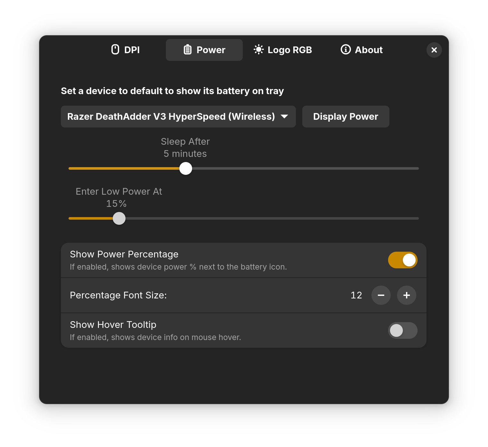

* [Introduction](#introduction)
* [Requirements](#requirements)
* [Features](#Features)
    * [v1.0](#v10)
* [Disclaimer](#disclaimer)
* [Contact](#contact)

# Introduction

Razer Puppy is a free and open source [Gnome](https://www.gnome.org/) desktop extension to display power status to configure DPI and Logo Rgb of Razer mice. It also registers a global hotkey to Gnome shell so that you can DPI switch while doing other tasks ie. playing a game. 

It utilizes [Open Razer](https://openrazer.github.io/) DBus daemon. So make sure it is installed and fully functional.

# Requirements
1. [Gnome 46,47 or 48](https://gnome.org/) 
2. [Open Razer](https://openrazer.github.io/#download) 

# Features 
## v1.0
* Gnome tray battery power icon. Shows power status (Full / Good / Low), charging status, power percentage next to battery icon and on hover (both can be enabled / disabled in the settings).
* Displays list of plugged in Razer mice and their respective on board DPI values.
* Can select a new DPI from the menu (or with global hotkey).
* Settings to configure global DPI switch hotkey. This lets the user change the DPI, regardless of the active window.
* If there is a device with Logo RGB, the color and light effects can be configured in the settings.
* Can set a default device to display power of and a default mice to bind to DPI hotkey.

# Screenshots

The extension in the tray looks like this. It can be configured to remove percentage text or make it display on mouse hover.

The menu is dynamic, it will add / remove Razer mice when they are plugged in or out. So are the on-board dpi of the respective mice. 

**The values in ALL of the settings below are going to be written into the device itself. So they will retain these values regardless of the software or computer.**

DPI settings. All plugged in Razer mice will be displayed here. You could have multiple Razer mice, all of which will be displayed here. And you can select which mouse your hotkey will work on. Here you can also set the poll rate and set new DPI for your mouse. 

All plugged in razer devices with a battery (not just mice, ie keyboards too) will be displayed here. Here you can set sleep duration (for power saving) and low power mode treshold.It will instantly apply to the device as you change the settings.

All plugged in Razer devices with a Logo RGB feature will be displayed here. You can select Off / Static / Breathe Single, Dual, Random / Spectrum / Reactive (on scroll) and with 0/1/2 color (depending on what you select) as well as the brightness. It will instantly apply to the device as you change the settings.

# Disclaimer

1) This project is not affiliated either with [Razer Inc.](https://www.razer.com/) nor [Open Razer](https://openrazer.github.io/).
2) I have made this project for my own use. I own 2 Razer mice, one with a battery and the other with a RGB. So my tests are limited to these two devices. 

 
# Contact
ayhanavci@gmail.com

Enjoy,
Ayhan